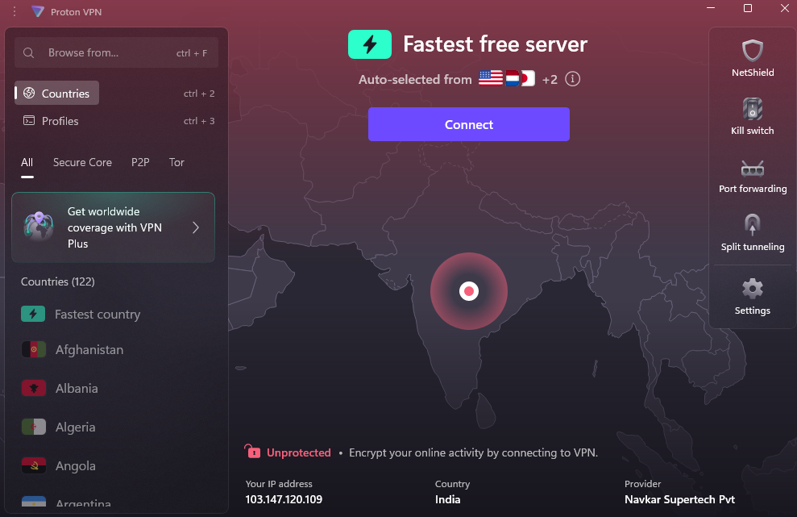
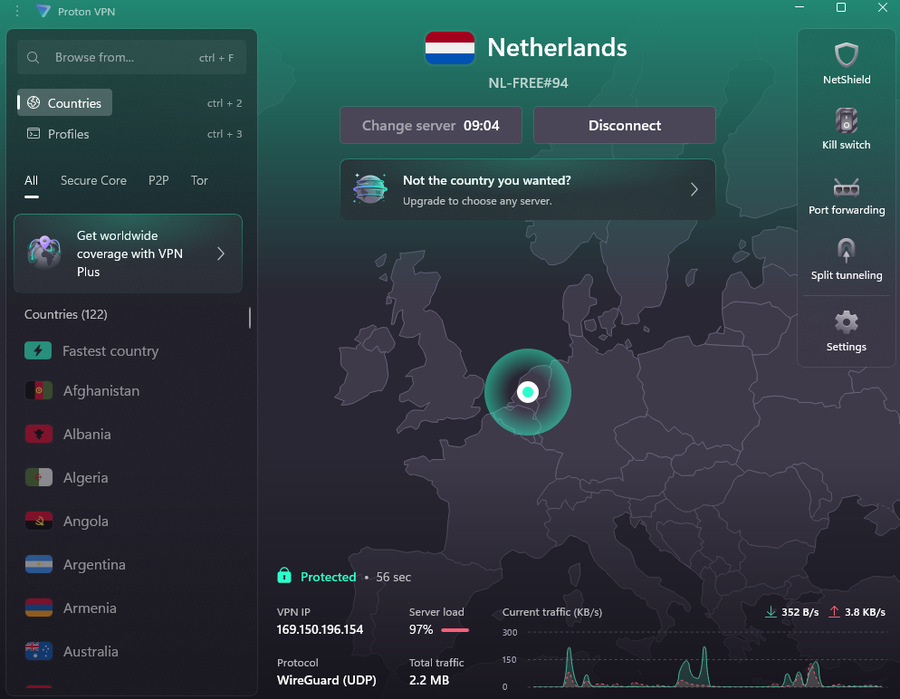
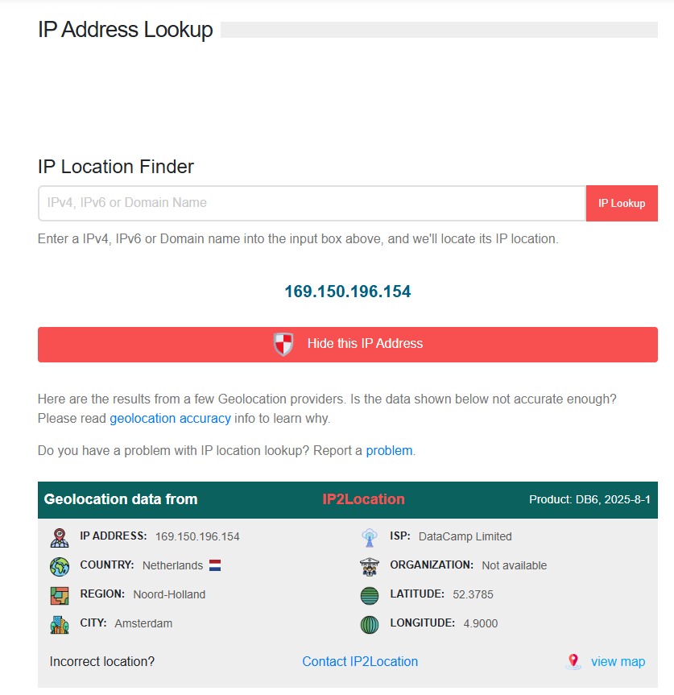

# Task 8: Working with VPNs

## Objective
To understand the role of VPNs in protecting privacy and secure communication.

## Tools
- ProtonVPN (Free version)

## Steps Followed
1. Installed ProtonVPN free client.
2. Connected to a free server (Netherlands).
3. Verified IP before VPN connection:
   - IP: 103.147.120.109 (India)
   - ISP: Navkar Supertech Pvt
4. Verified IP after VPN connection:
   - IP: 169.150.196.154 (Netherlands, Amsterdam)
   - ISP: DataCamp Limited
5. Browsed websites successfully with encrypted traffic.
6. Compared browsing with VPN ON vs OFF.

## Screenshots
- Before VPN connection (India IP)  

- After VPN connection (Netherlands IP)  

- ProtonVPN client showing connection status  

## Observations
- IP address changed successfully, confirming VPN tunneling.
- Traffic was encrypted using WireGuard (UDP).
- Connection speed was slightly reduced due to encryption.
- VPN improved privacy by masking real IP.

## Benefits of VPN
- Hides real IP and location.
- Encrypts traffic to prevent eavesdropping.
- Helps bypass geo-restrictions.

## Limitations of VPN
- Free plans have limited speed and server options.
- Not a guarantee of complete anonymity.
- Some websites may block VPN traffic.
